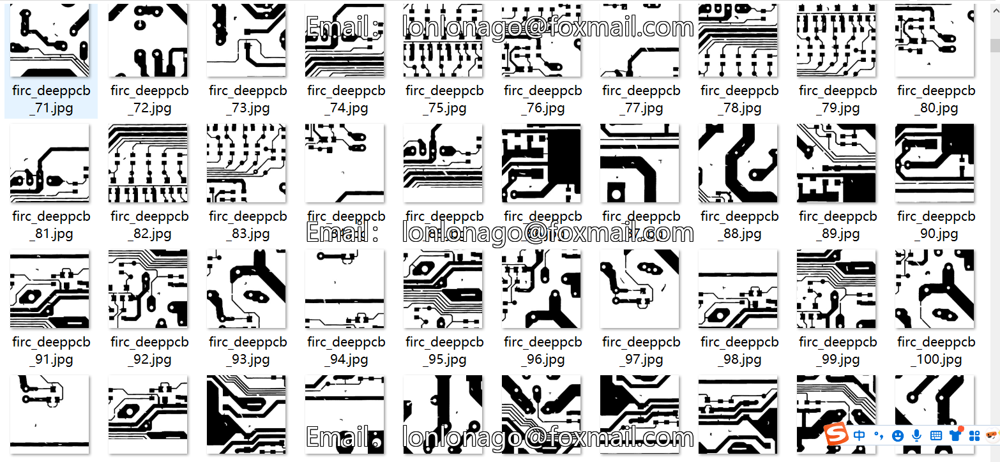
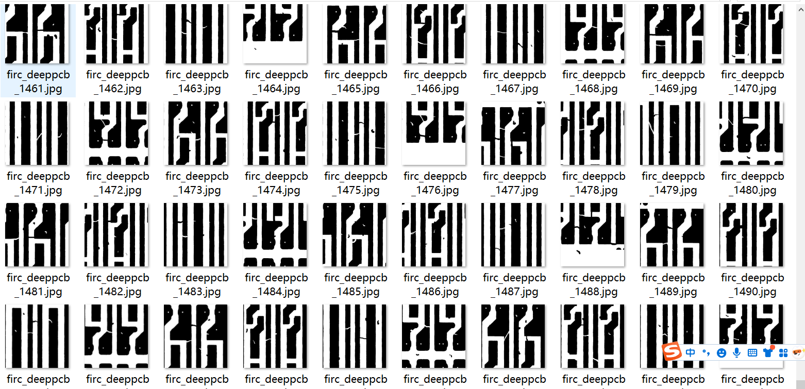
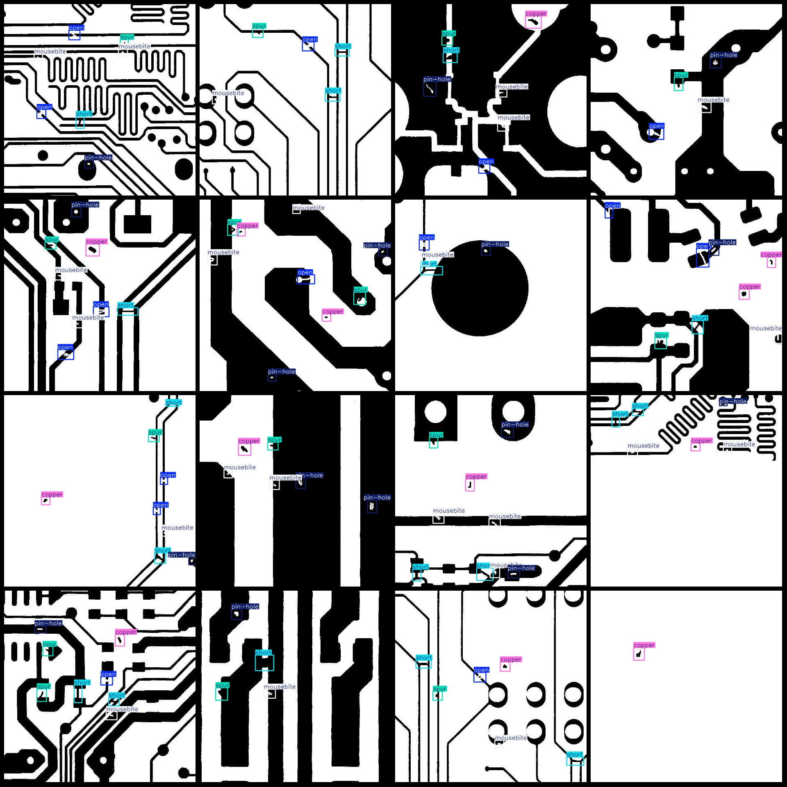
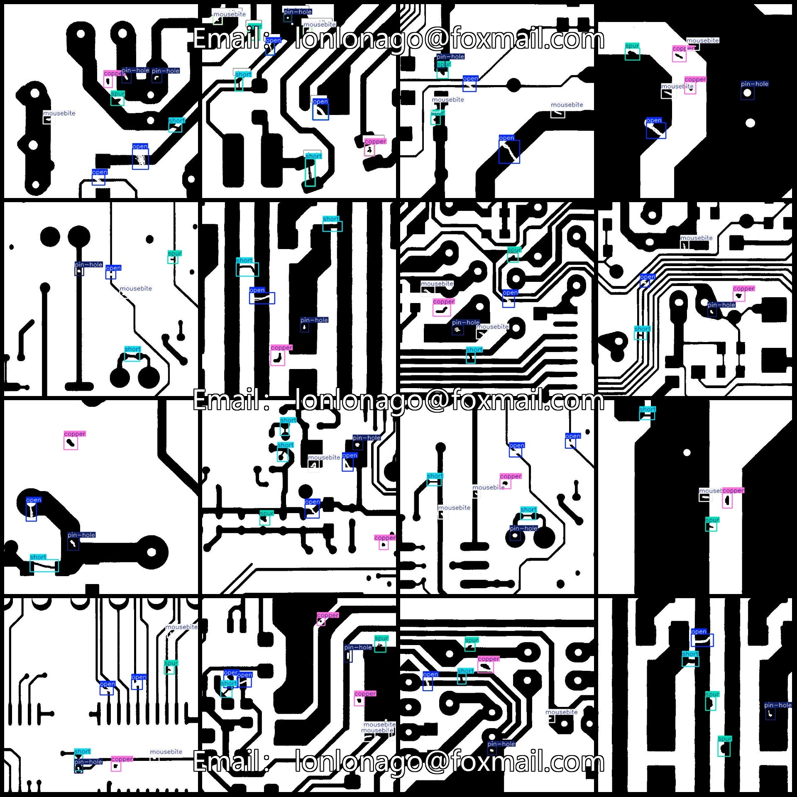

# DeepPCB PCB Board Defect Detection Data Set (VOC+YOLO Format) 1500 Images in 6 Categories

Dataset format: Pascal VOC format + YOLO format (without split paths in the txt file, only contain jpg images along with corresponding VOC format xml files and YOLO format txt files).

Number of images (jpg file count): 1500
Number of annotations (xml file count): 1500
Number of annotations (txt file count): 1500
Number of annotation categories: 6
Annotation category names (note that the order of categories in the YOLO format does not correspond to this, but rather based on the labels folder "classes.txt"): ["copper", "mousebite", "open", "pin-hole", "short", "spur"]
Number of bounding boxes for each category:
- copper : 1474 bounding boxes
- mousebite : 1965 bounding boxes
- open : 1942 bounding boxes
- pin-hole : 1501 bounding boxes
- short : 1506 bounding boxes
- spur : 1625 bounding boxes
Total bounding boxes: 10013
Image resolution: 640x640
Annotation tool used: labelImg
Annotation rules: Draw bounding boxes for categories
Important note: No special statement is made at this time
Special declaration: This dataset does not guarantee the accuracy of trained models or weight files

Annotation example:
## Images

Here is a pay link on Stripe ( https://buy.stripe.com/3cs8yP7sY87d0vu9AB ). Please contact me lonlonago@foxmail.com after funding $89, and I will send you a complete data files , thank you!

